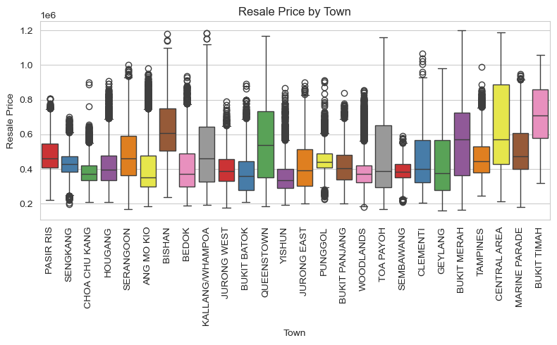

# mlnotes2718-RegressionEndToEnd

## HDB Resale Price Prediction Model

**Description:**

This project is an end to end machine learning pipeline that make prediction on HDB resale price. The purpose of this project is to help a property firm to predict housing prices using regression model.

## Problem Statement

Our task is to assist the property firm Cataria to develop a machine learning model that could accurately predict the resale prices of HDB resale flats. This model will assist buyers  in planning their budgets more effectively and set realistic expectations. This model also needs to help buyers determine the type of flat they can afford and in which location. This model also should provide sellers with valuable information regarding the potential market value of their property.

## Installation, Configuration & Execution

### Folder Structure
The zip file once expanded will have the following folder structure:
```css
.
├── .github
├── README.md
├── EDA.ipynb
├── Dockerfile
├── requirements.txt
├── env.yml
├── environment.yml
├── main.py
└── data
    └── resale_transactions.csv
└── src
    ├── data_preparation.py
    ├── config.yaml
    ├── optuna_params.py    
    └── model_training.py
└── tests
    ├── conftest.py
    ├── test_pipeline_integration.py    
    ├── test_data_preparation.py
    └── test_model_training.py        
```

- At the root folder, we have this document `README.md`, exploratory data analysis file `eda.ipynb`, main program file `main.py`.
- The rest of the files in the root folders are different environment files for different system. We also have a docker file for deployment use.
- The subfolder `data` contains the data file.
- The subfolder `src` contains all other program files and configuration file. The main program file `main.py` will call the files in the `src` folder.
- The subfolder `test` contains all files related to unit and integration testing.


### Requirements
The required packages are as shown below in requirements.txt

```text
matplotlib==3.10.0
python==3.11.11
numpy==1.26.4
pandas==2.2.3
pip==25.0
PyYAML==6.0.2
scikit-learn==1.6.1
seaborn==0.13.2
optuna==4.4.0
optuna-integration==4.4.0
lightgbm==4.6.0
xgboost==3.0.1
ipywidgets==8.1.5
pytest==8.4.1
pytest-cov==6.0.0
```

Please use the following command to create a new conda environment:

```bash
conda create env --name <ENV_NAME> python=3.11 --file environments.yml
```

Alternatively, use the following command to create a new conda environment with the latest version:

```bash
conda create env --name <ENV_NAME> python=3.11 --file env.yml
```

For venv or Linux environment, please use the following command:

```bash
pip install -r requirements.txt
```

To run in docker, we need to build the docker image using the command:
```bash
docker build -t hdb-resale-app .
```

To launch a container and run the container using the image built.
```bash
docker run -p 8000:8000 hdb-resale-app
```

To launch a container and run the container in the background.
```bash
docker run -d -p 8000:8000 hdb-resale-app
```

### Execution

To start the pipeline, we need to trigger the main program which is called `main.py`.

At the root folder where `main.py` is located, run the following command:

```bash
python main.py
```

For unit and integration testing, use the command:
```bash
pytest
```

### Configuration of Pipeline
All configuration are location in (`../src/config.yaml`)

The configuration file allows the following setting:
- Set the location of the data file : `file_path: './data/resale_transactions.csv'`
- Set the name of the target column : `target_column: resale_price`
- Set the size of test data (in Fraction) and validation data (in Fraction) : `val_test_size: 0.2` and `val_size: 0.5`
- Set the ype of the features for our preprocessing pipeline 
```yaml
## Features Classification
numerical_features:
  - floor_area_sqm
  - remaining_lease_by_months
  - transac_year
nominal_features:
  - transac_month
  - town_name
  - flatm_name
  - flat_type
passthrough_features:
  - storey_range
```

### Configuration of Optuna Parameter Distributions
We need to use another configuration file to store optuna parameters disctribution for hyperparameter tuning, the file is located in (`../src/optuna_params.py`)
- Set the Optuna grid search CV parameters distributions
- For each model, we also set the number of cross validation fold, trials and scoring metrics
```python
## Optuna Grid Search CV
params_config = {
    "XGBoost_tuned": {
        "estimator": xgb.XGBRegressor(n_jobs=-1),
        "param_distributions": {
            "regressor__subsample":         FloatDistribution(low=0.72, high=0.88),
            "regressor__reg_lambda":        IntDistribution(low=1,    high=1,    step=1),
            "regressor__reg_alpha":         IntDistribution(low=1,    high=2,    step=1),
            "regressor__n_estimators":      IntDistribution(low=160,  high=240,  step=1),
            "regressor__max_depth":         IntDistribution(low=8,    high=10,   step=1),
            "regressor__learning_rate":     FloatDistribution(low=0.09, high=0.11),
            "regressor__gamma":             IntDistribution(low=1,    high=1,    step=1),
            "regressor__colsample_bytree":  FloatDistribution(low=0.72, high=0.88),
        },
        "cv": 5,
        "trials": 60,
        "scoring": "neg_mean_absolute_error",
    },

    "LightGBM_tuned": {
            "estimator": lgb.LGBMRegressor(verbose=-1, n_jobs=-1),
            "param_distributions": {
                "regressor__subsample":         FloatDistribution(low=0.9,  high=1.0, log=False),
                "regressor__reg_lambda":        IntDistribution(low=1,    high=2,   step=1),
                "regressor__reg_alpha":         IntDistribution(low=1,    high=1,   step=1),
                "regressor__num_leaves":        IntDistribution(low=102,  high=152, step=1),
                "regressor__n_estimators":      IntDistribution(low=80,   high=120, step=1),
                "regressor__min_child_samples": IntDistribution(low=16,   high=24,  step=1),
                "regressor__max_depth":         IntDistribution(low=8,    high=10,  step=1),
                "regressor__learning_rate":     FloatDistribution(low=0.18, high=0.22, log=False),
                "regressor__colsample_bytree":  FloatDistribution(low=0.9,  high=1.0, log=False),
            },
            "cv": 5,
            "trials": 30,
            "scoring": "neg_mean_absolute_error",
        },
}
```

## Machine Learning Pipeline
The following flowchart shows our machine learning pipeline. It started with data cleaning followed by data processing and them model training and evaluation.


### Data Cleaning
Under data cleaning, we started with downloading the data and perform data cleaning such as removing duplicated items, fixing structural errors such as wrong classification labels and spelling mistake.  We also fixed missing values at this stage. 

### Data Preprocessing
At this stage, we start to perform feature engineering converting storey range to numerical values, converting transaction year month column into transaction year and transaction month. In addition, we also convert remaining lease from years to month. Finally, we drop the redundant features and set up the preprocessing pipeline to perform encoding for nominal and ordinal data. We also add scaling for the numerical values. Data cleaning and data preprocessing are run in the same python script `data_preparation.py`.

### Model Training
At the model training stage, we start off by loading the configuration and train the baseline model using the default settings. Then we proceed to perform further model fine tuning using grid search CV and random search. 

### Model Evaluation
From the training result, we will choose the model and parameters with the best score and applied the best model to the test data.   

## EDA Key Findings
- **Floor area is the most important feature in the analysis of resale flat.**


- **Our target resale price is normally distributed with a skewed to the right.**


- **There is a linear relationship between hdb resale price and floor area.**


- **For the same flat type with the same model and similar floor area, not every town command the similar resale price range. Some town has higher median resale price compared to other town. This proves that location matters.**



- **If we breakdown the flat by town, flat type and flat model, for some location, there is no dispersion. However for some location, the dispersion of the floor area and resale price is much narrower compared to fewer grouping. However, some flat model still present a slightly wide dispersion in terms of flat model and resale price.**
- **If we narrow our selection to flat type and model type, we may not have accurate prediction without the indication of floor area.**
- **The best feature to predict housing price is the floor area. However, we will can keep the flat type and flat model to provide us segmentation information so that we can improve the prediction of resale price. Location information is important to differentiate the price in different town.**


**Correlation Analysis**
- **For Pearson correlation analysis, there is a strong correlation between floor area and resale price. There is also moderate correlation between resale price and lease commence date which in turn indicating the age of the flat. The features, lease commence date and remaining lease in months are highly correlated. Therefore, it is suggested that we either use Ridge Regression to reduce the impact of multicollinearity or we drop one of the feature.** 


- **For Spearman Correlation Analysis, there is strong correlation between floor area and resale price. Moderate correlation between age of the flat and the resale price. Moderate to weak correlation between height of the flat and resale price. Similarly, there is high correlation between lease commence date and remaining lease in months. Remaining lease in months are slightly more correlated to the resale price, as it is more granular. Therefore, we can consider dropping lease commence date if necessary.**


## Feature Engineering

- **We drop the column `lease_commence_date` and convert `remaining_lease` from string into integer with column name `remaining_lease_by_month`.** 
- **We convert the string column `month` to transaction year (`transac_year`) and transaction month (`transac_month`). This is intended to get the model to detect seasonality.**
- **We will keep the `flat_type` and `flatm_name` (flat model) to improve the prediction by providing segmental information.**
- **Since, we found the outliers of 3-Room flat with a large floor area. We think `flat_type` is not ordinal, thus we will use nominal encoding instead.**

**Numerical Features**
| Feature Names | Type Before  | Type After Conversion | Processing Steps  |
| ------------- |:-------------:| :-----: | :----------------| 
| floor_area_sqm | float | float | no change |
| transac_year | string | integer | convert from string column `month` to year by extracting the year using date time function |
| remaining_lease_by_months| string | integer | convert from string column to numeric data by calculating the years and months into months in total  |
| storey_range| string | integer | convert from string column to numeric data by calculating middle of the floor indicated in the string  |

**Categorical Features**
| Feature Names | Type Before | Type After Conversion | Processing Steps  |
| ------------- |:-------------:| :-------------: | :-----|
| flat_type | string | one-hot encoded | one-hot encoding |
| town_name | string | one-hot encoded | one-hot encoding |
| flatm_name | string | one-hot encoded | one-hot encoding |
| transac_month | integer | one-hot encoded | one-hot encoding |


## Model Selection

### Linear Regression Analysis and Evaluation
- Our original intention is to use **Linear Regression** as our **baseline models**. Evaluation of residual plot shows that Linear Regression could not capture the non-linearity.


- We added polynomial features of 6 degrees and performance improved slightly.
- Since the housing price is skewed, we performed target transformation.

MODEL PERFORMANCE COMPARISON
|                 |                      |       MAE  |     RMSE  |    R2 |
| --- | --- | --- | --- | --- |
| Category         | Model                |           |           |       |                  
| Original         | Polynomial Regression | 39953.6265 | 52576.7120 | 0.8708 |
|                  | Ridge Regression      | 40429.4529 | 53141.9033 | 0.8680 |
|                  | Lasso Regression      | 40619.3463 | 53360.7955 | 0.8669 |
| Target Transformed | Polynomial Regression | 35358.9860 | 50060.5813 | 0.8829 |
|                    | Ridge Regression      | 35861.9931 | 51259.2275 | 0.8772 |
|                    | Lasso Regression      | 37712.4970 | 54034.0685 | 0.8635 |

- Base on the above result, Target Transformed Polynomial Regression achieve the best result. This is expected as regularization on Ridge and Lasso Regression will reduce the weights of the coefficient.
- However, we believe that with fine tuning, Ridge and Lasso Regression may generalized well on the test dataset.
- Since the target is skewed and residual plot show non-linearity. This dataset is a good candidate to test with tree-based model starting with Decision Tree.

| Model | MAE |	RMSE | R2 |
| --- | --- | --- | --- |		
| Decision Tree |	30779.3878 |	45315.1130 |	0.9040 |

- Using basic Decision Tree Regressor model without any parameter tuning, our error reduced and performance improvement is much better than Linear Regression with transformed target. 
- We have a MAE of $30K and R-squared of 90%. We believe that any parameter fine tuning on linear model will not be able to outperform the decision tree base line model. 
- **We will stop using linear models and adopt tree-based model as our recommended model.**

- We apply the following models; Decision Tree, Random Forest, XGBoost and LightGBM; without any fine tuning.

| Model | MAE |	RMSE | R2 |
| --- | --- | --- | --- |		
| Decision Tree |	30779.3878 |	45315.1130 |	0.9040 |
| Random Forest |	23998.6907 |	34272.6371 |	0.9451 |
| XGBoost |	26119.7319 |	36113.8921 |	0.9390 |
| LightGBM |	28837.0689 |	39454.9996 |	0.9272 |

- Without any parameters tuning, Random Forest shows the most promising results, followed by XGBoost and LightGBM. 
- We plan to use the 3 models (Random Forest, XGBoost and LightGBM) for further hyperparameter tuning. 
- Decision tree without tuning will be the base line model for sanity check.


## Model Evaluation

### Baseline Model Evaluation

- We apply the following models; Decision Tree, Random Forest, XGBoost and LightGBM; without any fine tuning.

| Model | MAE |	RMSE | R2 |
| --- | --- | --- | --- |		
| Decision Tree |	30779.3878 |	45315.1130 |	0.9040 |
| Random Forest |	23998.6907 |	34272.6371 |	0.9451 |
| XGBoost |	26119.7319 |	36113.8921 |	0.9390 |
| LightGBM |	28837.0689 |	39454.9996 |	0.9272 |

- Without any parameters tuning, Random Forest shows the most promising results, followed by XGBoost and LightGBM. 
- We plan to use the 3 models (Random Forest, XGBoost and LightGBM) for further hyperparameter tuning. 
- Decision tree without tuning will be the base line model for sanity check.


### Grid Search Model Evaluation

**Grid Search Strategy**

- We will use **MAE** as the main metric because it is most easy to be understood by the stakeholder.
- We have performed fine tuning with a 3 stage parameters fine tuning starting with **Randomized Search** for stage 1 using the widest search space. 
- Then we will use **Halving Randomized Search** based on the search result of stage 1 and 
- finally, we will use **Optuna Search** to finalized the search parameters.
- However, after several hours of fine tuning, our MAE did improved a few hundred dollars. This is not acceptable as the improvement is marginal compared to the resource we have put in. 
- We change our strategy to start with **Randomized Search** and follow by **Optuna Search CV**.
- We will not be fine tuning **Random Forest** with **Optuna Search CV**, as the processing time and computing resources is to much for minimal improvement. We will apply **Random Forest** without fine tuning.
- For **Randomized Search**, we use only 3-fold cross validation, and we limit the iterations from 2 to 60.  
- For further fine tuning, we will be using **Optuna Search CV** with 5 cross validation folder around our searched parameters.
- However, our trial will be limited as our base line model already achieve relativelt good performance.

| Model | MAE |	RMSE | R2 |
| --- | --- | --- | --- |		
| Random Forest (def) |	23998.6907 |	34272.6371 |	0.9451 |
| Random Forest (randomzied search) |	23784.1134 |	33577.7145 |	0.9473 |
| XGBoost |	23374.9271 |	32876.9777 |	0.9495 |
| LightGBM |	24304.8112 |	34039.0112 |	0.9458 |

- **Base on the final validation scores, we will use XGBoost as our recommend model.**
- **Final evaluation on the test data set confirms the recommendation.**


## Consideration for Deployments
- Using tree-based regressor model is computing intensive especially for random forest. 
- Therefore, we use **Decision Tree Regressor** and **Random Forest Regressor** as our baseline model without fine tuning.
- We only perform minimal fine tuning with **Optuna Search CV** in production.

## END OF REPORT


